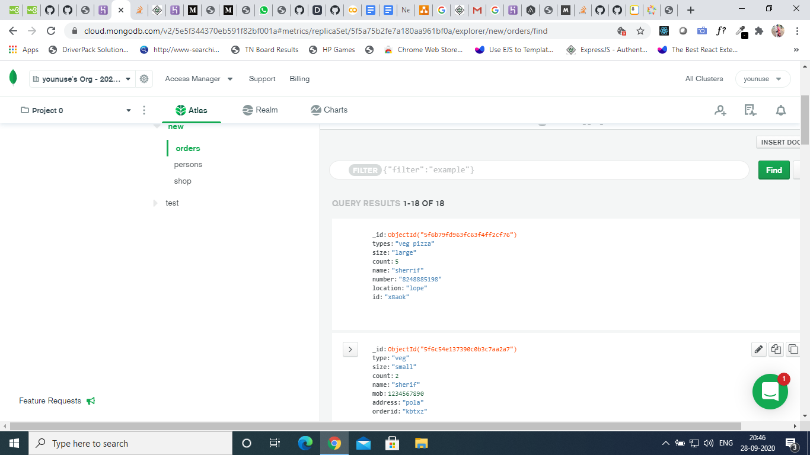
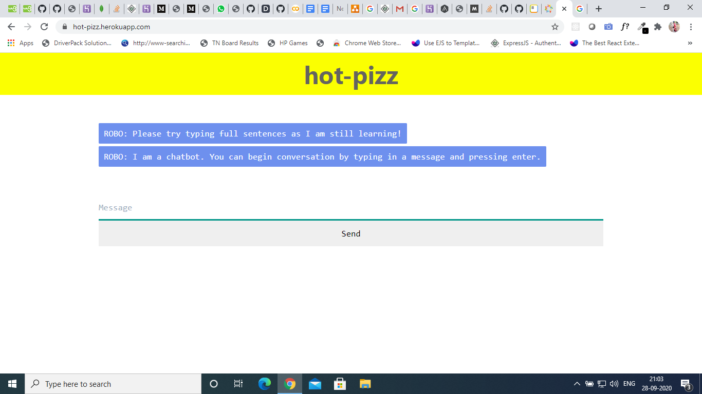

# Hot-pizz - Pizza-Ordering-Chatbot

This is Chatbot implementing NLP by **Python-NLTK**.

## Language
python

## Prerequisite
python-NLTK
python-Flask
HTML & CSS
JavaScript


|STEPS                |DESCRIPTION
|----------------|-------------------------------
|`"Sentence Tokenization"`| Sentence tokenizer breaks text paragraph into sentences.
|`"Word Tokenization"`   |   Word tokenizer breaks text paragraph into words.         
|`"Stemming"`         | stemming just removes the last few characters, often leading to incorrect meanings and spelling errors
|`"Lemmatization"`    | lemmatization considers the context and converts the word to its meaningful base form

```python
import nltk
nltk.dowload()
```
## Sentence Tokenization
```python
sent_tokens  =  nltk.sent_tokenize(text)
```
## Word Tokenization
```python
sent_tokens  =  nltk.sent_tokenize(text)
```
## Stemming and Lemmatization
```python
lemmer = nltk.stem.WordNetLemmatizer()
def LemTokens(tokens):
	return [lemmer.lemmatize(token) for token in tokens]
remove_punct_dict = dict((ord(punct), None) for punct in string.punctuation)
def LemNormalize(text):
	return LemTokens(nltk.word_tokenize(text.lower().translate(remove_punct_dict)))
```
## Feature Extraction
```python
from sklearn.feature_extraction.text import TfidfVectorizer
from sklearn.metrics.pairwise import cosine_similarity

TfidfVec = TfidfVectorizer(tokenizer=LemNormalize, stop_words='english')
tfidf = TfidfVec.fit_transform(sent_tokens)
vals = cosine_similarity(tfidf[-1], tfidf)
```
## MongoDB
###### MongoDB is an NOSQL database for ChatBot.All the order are stored in the Database



## Application
[hot-pizz Chatbot](https://hot-pizz.herokuapp.com/)


